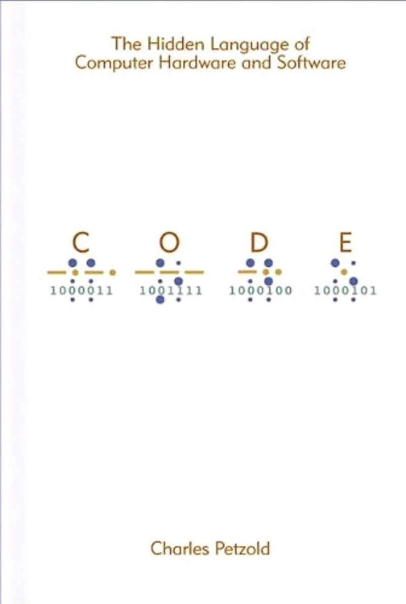

A pleasant journey into the history of the birth of technologies that together gave us the modern world of semiconductors, communications, computers, software.
Although I know almost all of these events separately, I even observed some of them personally, it was very interesting to read this book.

I recommend.

<!--more-->

